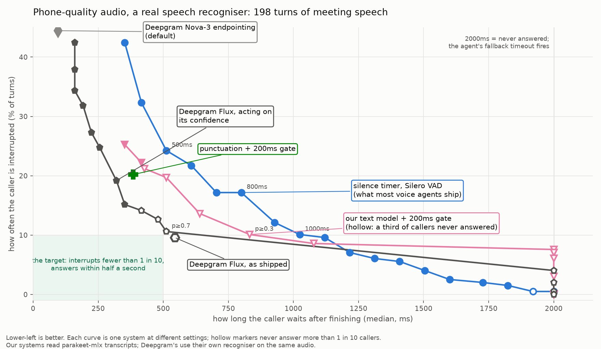
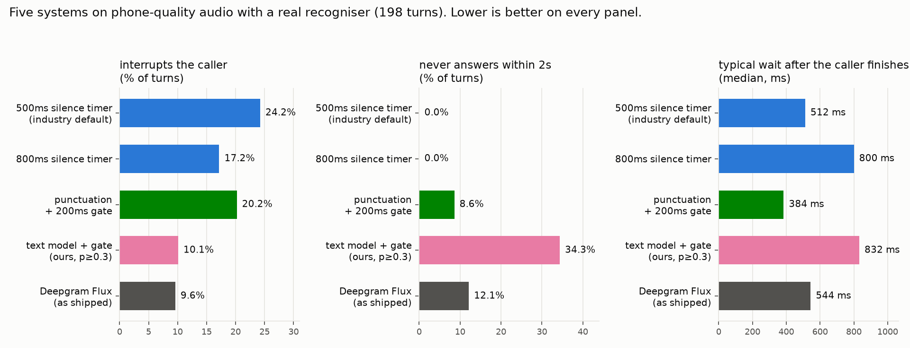

# SARA — Semantic End-of-Turn Detection for Voice Agents

When you talk to an automated phone agent it has to guess the moment you have
finished speaking. Guess too early and it talks over you (*"my order number
is… umm…"*); guess too late and you get dead air after a short answer
(*"yes"*). Nearly every production system makes that guess the same way: it
waits for 500–1000ms of silence.

This project measures how well that guess can be made — by the silence timer
everyone ships, by a one-line punctuation heuristic, by a small text
classifier trained here, by a prosody classifier, and by the closest
commercial product, Deepgram Flux — on the same 198 held-out turns of
real conversation, on clean audio and on phone-quality audio, as full
tradeoff curves rather than a single number each.

**The evaluation is the contribution; the models are participants in it.**
Every number on this page is read from a file in [`results/`](results/) by
[`scripts/write_readme.py`](scripts/write_readme.py) — nothing is typed — and
a test fails if the page and the CSVs disagree.

## In one picture



Every system moves along a curve as its setting changes: further right, the
caller waits longer; higher, more callers get interrupted. The shaded corner
— interrupts fewer than one caller in ten, answers within half a second — is
what everyone wants and nothing reaches. Hollow markers mean the system left
more than one caller in ten with no answer at all.

## Three findings

1. **The industry default is measurably bad.** A 500ms silence timer
   interrupts **17.2%** of turns on clean audio and **24.2%** on
   phone audio. Lengthening it trades interruptions for dead air; no timeout
   fixes both.
2. **Reading the words helps, and a real recogniser eats most of the gain.**
   On perfect transcripts, a 200ms silence gate plus a punctuation check
   matches the 800ms timer's interruptions (11.1% vs 10.6%) at a
   third of the wait (256 vs 800ms). Through a real recogniser on
   phone audio it interrupts 20.2% — worse than the timer. The text
   model is the only system built here that interrupts less than the timer
   there (10.1% vs 17.2%), and it leaves 34.3% of
   callers waiting out the timeout, so it is not something to ship.
3. **Deepgram Flux is the best system measured on phone audio, and nothing
   here beats it on all three counts.** 9.6% interruptions, 12.1%
   never answered, 544ms wait. Sweeping its confidence threshold
   passes straight through its default setting: there is no hidden better
   one. Said plainly, because the charter requires it.

## How to read the numbers

Three numbers describe every system, each measured from the audio-grounded
moment the speaker actually stopped:

- **Interrupts** — the system decided the turn was over more than 150ms
  *before* it was. The caller gets talked over. (In the CSVs: `cutoff_rate_at_tolerance`.)
- **Never answers** — two seconds after the caller stopped the system still
  had not decided, so the agent's fallback timeout fired instead. Dead air.
  (`false_hold_rate`.)
- **Wait** — the median time between the caller stopping and the system
  deciding. A never-answered turn counts as the full 2000ms. (`latency_fallback_p50`.)

They trade against each other. A system is only better if it improves one
without paying more on the other two, which is why the charts show curves
and not single points.

## The numbers



Two conditions are tabled below. **Clean:** perfect human transcripts and
wideband audio, the best case. **Phone:** a real streaming recogniser on
300–3400Hz μ-law audio, the deployment case.

### Clean audio, perfect transcripts

| system | interrupts | never answers | wait |
|---|---|---|---|
| Silero VAD + 500ms timer *(the industry default)* | 17.2% | 2.0% | 512 ms |
| Silero VAD + 800ms timer | 10.6% | 4.5% | 800 ms |
| Silero VAD + 1000ms timer | 4.0% | 7.6% | 1056 ms |
| punctuation heuristic, bare | 24.7% | 6.6% | 96 ms |
| **punctuation + 200ms silence gate** | 11.1% | 9.1% | 256 ms |
| text model v1.1 (bert-mini), bare | 15.7% | 58.1% | 2000 ms |
| text model v1.1 + 200ms gate, p≥0.3 | 7.6% | 44.9% | 352 ms |
| prosody classifier + gate, p≥0.5 | 24.7% | 9.6% | 256 ms |
| prosody + text + gate, p≥0.5 | 23.7% | 12.1% | 256 ms |
| Deepgram Flux, as shipped *(own recogniser, same audio)* | 7.6% | 11.1% | 576 ms |

### Phone audio, real recogniser

| system | interrupts | never answers | wait |
|---|---|---|---|
| Silero VAD + 500ms timer *(the industry default)* | 24.2% | 0.0% | 512 ms |
| Silero VAD + 800ms timer | 17.2% | 0.0% | 800 ms |
| Silero VAD + 1000ms timer | 10.1% | 0.0% | 1024 ms |
| punctuation heuristic, bare | 47.0% | 4.5% | 416 ms |
| punctuation + 200ms silence gate | 20.2% | 8.6% | 384 ms |
| **text model v1.1 + 200ms gate, p≥0.3** | 10.1% | 34.3% | 832 ms |
| prosody classifier + gate, p≥0.5 | 25.8% | 20.2% | 288 ms |
| prosody + text + gate, p≥0.5 | 21.7% | 19.7% | 336 ms |
| **Deepgram Flux, as shipped** *(cloud, own recogniser)* | 9.6% | 12.1% | 544 ms |
| Deepgram Flux, acting on its confidence at 0.5 | 19.2% | 9.1% | 320 ms |
| Deepgram Nova-3 `speech_final`, default endpointing | 44.4% | 3.5% | 96 ms |
| punctuation + gate, on Nova-3 transcripts | 21.7% | 18.7% | 288 ms |
| text model + gate, p≥0.3, on Nova-3 transcripts | 10.6% | 48.5% | 2000 ms |

The systems built here read parakeet-mlx transcripts (a local recogniser)
unless a row says Nova-3; Deepgram's own detectors hear the audio directly,
so there is no perfect-transcript condition for them — their "clean" row is
the same wideband audio the other systems use. Full sweeps:
[`results/tradeoff.csv`](results/tradeoff.csv); every condition:
[`results/conditions.csv`](results/conditions.csv).

## The full picture


Every system at every setting on clean audio with perfect transcripts: the
ceiling. 198 held-out turns from the AMI Meeting Corpus (19 meetings,
19 speakers; frozen, SHA256-manifested, never trained on). Reading:
[`results/tradeoff.md`](results/tradeoff.md).


The same systems under six conditions — perfect transcripts, a local
streaming recogniser (parakeet-mlx) and a cloud one (Deepgram Nova-3), each
at wideband and in the telephony band. The Nova-3 panels also carry
Deepgram's own detectors. Reading:
[`results/conditions.md`](results/conditions.md).

## What worked

- **The industry default is measurably bad.** A 500ms silence timer
  interrupts **17.2%** of turns on this data. Cutoffs concentrate in
  disfluent speech; dead air concentrates in short answers. No timeout fixes
  both.
- **A 200ms silence gate in front of a semantic signal.** On gold
  transcripts a one-character punctuation heuristic behind the gate matches
  the 800ms timer's cutoff rate (11.1% vs 10.6%) at a third of the
  latency (256 vs 800ms) — the first system into the chart's empty
  bottom-left. The gate is the finding: semantics reduce the silence a system
  needs; they do not replace it.
- **Training the text model on words alone.** The model that never saw a
  trailing period lost 3.0 points of cutoff to a real recogniser
  where the punctuation heuristic lost 8.6. On the deployment
  condition the gated text model has **fewer cutoffs than the timer**
  (10.1% vs 17.2%) at the same median latency — the first
  time it beats the timer on anything — and 34.3% of callers wait out the
  fallback, so it is not a point to ship.
- **The measurement instrument.** An eval that replays gold word timings
  and never calls a recogniser, so a run reproduces byte for byte and a
  regression is always a change in our code; a boundary grounded in audio,
  because the corpus alignment absorbs pauses into word durations; a caller
  channel, because the headsets carry the next speaker. Each of those was a
  finding before it was a design.

## What didn't work

- **Two text-only models lose to a silence timer.** v1 (bert_uncased_L-4_H-256_A-4,
  11.2M parameters) fired on the first word — *"Okay"* is a whole turn 61% of
  the time in training and no text can tell — and v1.1, with the positive
  class weight removed, fired too little instead. Validation AP 0.551 on
  held-out speakers is the whole story; no threshold fixes a ranking. The
  text-only ceiling is measurable: on words alone 3.0% of training
  examples carry the same string with both labels.
- **The gold winner does not survive a real recogniser.** The gated
  heuristic goes 11.1% → 19.7% cutoff at wideband, 20.2% on
  telephony — more than the timer. The bare heuristic goes 24.7% → 54.0%:
  the optimism gap for a system reading annotator punctuation is about
  thirty points.
- **Prosody does not help.** Fourteen features of the last speech frame
  before a pause reach AP 0.716 alone (chance 0.585); the text logit alone
  reaches 0.860; both together 0.857. The signal that exists is energy —
  the last speech before a real end is quieter — and pitch carries none: a
  falling contour does not separate a turn's end from a hesitation on this
  data. Dominated by the gated heuristic at every threshold.
- **The telephony band hurts through the VAD.** Silero flaps more on
  band-limited μ-law audio; the 800ms timer goes 10.6% → 17.2% cutoff
  with the text untouched.
- **The recogniser is the largest degradation source, and none of it is
  ours.** parakeet-mlx over 1206s of eval audio: word error rate 20.9%
  against gold, 846 hypothesis revisions, 1.06× realtime on a shared
  GPU. Every text system pays for that before any of ours gets a say.
- **Two things were caught before they became results.** The headset tail
  carries the next speaker: on the raw recording the transcript kept growing
  after the true end on 139 of 198 turns, and a text system that should
  have held instead answered the wrong person. And the first prosody
  classifier scored a perfect 1.000 AP — it had learned to detect the
  zeroing that fixed the first problem. Both are in the commit history with
  their evidence.

## The commercial system, measured

Deepgram Flux is the closest thing on the market to what this project argues
for: one model doing recognition and end-of-turn together, no silence timer,
with a confidence reported on every update. It was run over the same 198
turns ([`scripts/deepgram_eval.py`](scripts/deepgram_eval.py), 2026-09-13), audio
paced at real time so that network and model latency land on the clock a
caller experiences, responses cached under `results/asr/` so the comparison
reproduces without a key. Reading: [`results/tradeoff.md`](results/tradeoff.md)
and [`results/conditions.md`](results/conditions.md).

- **Flux is on the Pareto front, and on the deployment condition it is the
  best system measured.** As shipped: 7.6% cutoff / 11.1% never
  answered / 576ms at wideband; 9.6% / 12.1% / 544ms on
  the telephony band, where the timer goes to 17.2% and the gated
  heuristic to 20.2%. Nothing here beats it on all three axes: the gated
  heuristic answers in half the time (256ms) and cuts off more; our gated
  model matches its cutoff rate and leaves three to four times as many
  callers waiting. Said plainly, as the charter requires.
- **Its usable range is one threshold wide.** Sweeping the fire threshold
  over the confidence it reports while a turn is open: 0.5 gives 20.7%
  cutoff at 320ms, 0.7 gives 8.6% at 544ms, and at 0.75 the
  holds jump to 61.1% because the confidence rarely gets there. The
  curve passes through the shipped point; the vendor's default is the knee,
  and there is no hidden better setting. Its holds are the one-word
  backchannels — *"Mm-hmm"*, *"Yeah"* — on which it never opens a turn.
- **Nova-3 is the better recogniser on every axis, and it moves the
  heuristic, not the model.** Word error 17.4% against parakeet's 20.9%,
  12 silent turns against 30, 118 hypothesis revisions against
  846, first partial 500ms after the first word. On its transcripts the
  gated heuristic drops 3.5 points of cutoff and pays for it in holds
  (18.2%: Nova-3's interim results carry no punctuation until the
  segment is final). The text model holds exactly as it does on gold
  (45.5% against 44.9%) — parakeet's lower hold rate was its
  revisions handing the model extra strings to score, not better text. And
  Nova-3's own default endpointing, `speech_final`, cuts off 36.9% of
  turns: a pause detector, not a turn detector.

## Known limitations

- **Meeting speech, not calls.** AMI is four-person meetings on headset
  microphones. Turn-taking dynamics differ from a phone agent's; a turn
  ending on *"yeah so"* is common here and rare there.
- **One corpus, 19 eval speakers, 198 turns.** One turn is 0.5%; differences
  under about two points are inside the noise.
- **Gold transcripts are a ceiling.** Human punctuation from someone who
  heard the whole recording; the real-ASR condition is the floor, with one
  recogniser on one machine.
- **Clean-line telephony.** Band-limit and codec, no injected noise, so runs
  reproduce byte for byte; real lines are worse. The caller channel is
  digital silence after the turn, which flatters energy thresholding.
- **The boundary shares a model with a baseline.** The true end of each
  turn is refined with Silero, which is also baseline #2; mitigated (raw
  probability, not the smoothed flag) and quantified (±150ms), not
  eliminated.
- **The live path is Apple Silicon only** (parakeet-mlx). The results
  reproduce on any machine from the cached recogniser output.
- **The cloud numbers are a snapshot.** Deepgram `flux-general-en` and
  `nova-3` were measured once, on 2026-09-13, paced at real time
  over five concurrent streams from one machine; the raw responses are
  cached under `results/asr/` so the numbers reproduce, but the vendor can
  change the model underneath them. Network latency is included in their
  clocks, as a caller would experience it.

## How to reproduce

Python 3.12 and [uv](https://docs.astral.sh/uv/). The runtime path is
onnxruntime and numpy; torch appears only in the training tier.

```bash
make install                              # runtime deps, uv-managed CPython
make test                                 # includes the eval-set freeze check

uv run python scripts/run_baselines.py    # the table, ~1 min
uv run python -m eval.sweep               # results/tradeoff.png, ~2 min
uv run python -m eval.conditions          # results/conditions.png, ~5 min
make readme                               # the two headline charts and this page
```

The frozen eval set, the recogniser caches under `results/asr/`, and both
models are committed, so the three commands above reproduce every number on
this page on any machine. Verified on a fresh clone at commit `09bd61b`
(2026-09-13): install, tests, the table, both CSVs' decision columns and this
page came out identical; only the CPU inference-latency column moved. Two tests skip without the optional
`data/raw/jfk.wav` sample, which is gitignored. To regenerate the inputs
instead:

```bash
# recogniser caches (Apple Silicon; ~15 min per condition)
uv run python scripts/transcribe_eval.py --condition 16k
uv run python scripts/transcribe_eval.py --condition tel

# Deepgram caches (DEEPGRAM_API_KEY or ~/.config/sara/deepgram_api_key;
# ~4 min and ~$0.15 per pass at list price; the key is never written anywhere)
uv run python scripts/deepgram_eval.py --backend nova3 --condition 16k
uv run python scripts/deepgram_eval.py --backend nova3 --condition tel
uv run python scripts/deepgram_eval.py --backend flux --condition 16k
uv run python scripts/deepgram_eval.py --backend flux --condition tel

# text model (make install-train first; ~3 min on an M4)
uv run python scripts/build_train_set.py
uv run python scripts/train_eot.py

# prosody classifier (~20 min: 1GB of training audio by range request)
uv run python scripts/fetch_train_audio.py
uv run python scripts/build_pause_set.py
uv run python scripts/train_prosody.py

# talk to it (Apple Silicon)
uv run python scripts/live.py --eot punct-gated
```

Do not rebuild `data/eval/`: it is frozen, and `scripts/freeze_eval_set.py`
refuses to re-freeze a changed set without `--force`.

## Where things are

```
src/eot/         the detector interface, the text model, the gate, the pause classifier
src/baselines/   silence timers, energy VAD, punctuation heuristic, the Deepgram client
src/audio/       Silero VAD, prosody tracker, telephony simulation, mic capture
src/stt/         streaming STT for the live path only -- never imported by eval/
eval/            harness, sweep, conditions; replays gold or cached recogniser/vendor output
scripts/         every build, fetch, train and report step, each runnable alone
data/eval/       198 frozen turns, audio and manifest, committed
results/         every number, chart and reading, committed
models/          Silero VAD, the text model, the pause classifier, with cards
```

The engineering charter — what is forbidden, and why — is
[`ENGINEERING.md`](ENGINEERING.md). Inbound calls only; any human test subject
is told they are talking to an automated system and that audio is recorded;
dataset licences are in [`data/README.md`](data/README.md).

## Glossary

- **Turn** — one stretch of speech by one person, up to the moment they hand
  over. The eval has 198 of them, each with its true end fixed from the audio.
- **End-of-turn detection** — deciding, while the audio is still coming in,
  that the current turn is finished. The whole problem.
- **Interrupts / cutoff** — the system fired before the true end (beyond a
  150ms tolerance for the boundary's own uncertainty).
- **Never answers / hold** — the system had not fired 2000ms after the true
  end; the agent's fallback timeout took over.
- **Wait / added latency** — time from the true end to the system firing.
- **Silence timer** — fire after N ms of no speech, as judged by a voice
  activity detector (VAD). Silero is the VAD used throughout.
- **Gate** — a short silence (200ms) that a semantic signal must also wait
  for before it is allowed to fire. Cheap, and the single most useful idea here.
- **Gold / perfect transcripts** — the human transcript, released word by
  word at the times the words were said. A ceiling no recogniser reaches.
- **Telephony band / phone audio** — 300–3400Hz and a G.711 μ-law round
  trip, simulated from the wideband recording.
- **Caller channel** — the eval audio zeroed after the turn ends, because the
  meeting headsets pick up the next speaker and a phone line would not.
- **Sweep** — running one system at every setting and drawing the curve.
