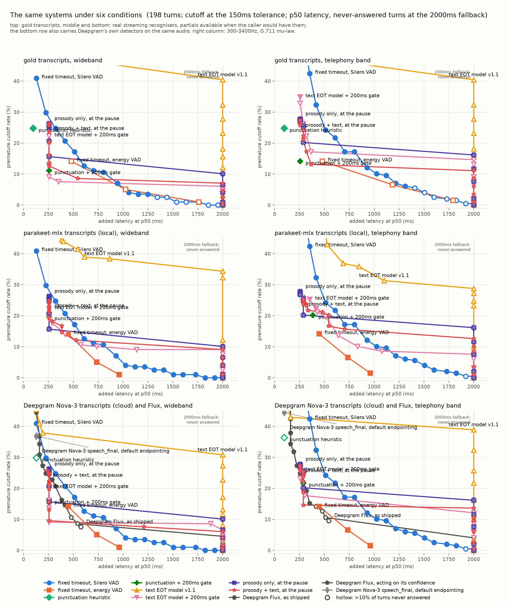

# Phase 6 — a real recogniser, and the telephony band

Every number here is from `conditions.csv`, produced by `uv run python -m
eval.conditions` over the 198 frozen turns. Cutoff is at the 150ms boundary
tolerance; a turn never answered is counted at the 2000ms fallback.

| condition | transcript | audio |
|---|---|---|
| `gold_16k` | gold, words released at their aligned ends | headset as recorded |
| `gold_tel` | gold | 300–3400Hz, G.711 μ-law round trip |
| `asr_16k` | parakeet-mlx partials, available at audio + compute time | **caller channel**, wideband |
| `asr_tel` | parakeet-mlx partials | **caller channel**, telephony band |
| `nova3_16k` | Deepgram Nova-3 partials, at their arrival on a real-time stream | **caller channel**, wideband |
| `nova3_tel` | Deepgram Nova-3 partials | **caller channel**, telephony band |

The two `nova3_*` panels also carry Deepgram's own detectors on the same
audio — Flux, and Nova-3's `speech_final` — which need no transcript from us.
Phase 10, below.

**Caller channel.** In the `asr_*` conditions every audio consumer — the
recogniser and the VAD — hears the frozen audio zeroed from `true_end + 150ms`.
AMI headsets carry the next speaker at low level once the floor changes hands,
and a recogniser transcribes them; a phone caller's channel never carried them.
The first pass on the raw tail is kept as `asr/parakeet_*_rawtail.json` and
`conditions_rawtail.csv`, and the story of why it had to be redone is below.

Recogniser: `mlx-community/parakeet-tdt-0.6b-v3`, parakeet-mlx 0.5.2, 2026-09-12,
640ms chunks, 1206s of audio in 1278s
(1.06× realtime, two passes sharing one GPU;
0.6× solo). Final transcript empty on 30 turns at wideband and 36 at
telephony band — the hypothesis emitted words and then collapsed; only 2 turns
produced no text at any partial.

## The delta per system

**Silero timer, 800ms**

| condition | cutoff | hold | p50 | p95 | Δ cutoff | Δ hold | Δ p50 |
|---|---|---|---|---|---|---|---|
| gold_16k | 10.6% | 4.5% | 800 | 1859 |  |  |  |
| gold_tel | 17.2% | 2.5% | 800 | 1568 | +6.6 | -2.0 | +0 |
| asr_16k | 10.6% | 0.0% | 800 | 864 | +0.0 | -4.5 | +0 |
| asr_tel | 17.2% | 0.0% | 800 | 928 | +6.6 | -4.5 | +0 |

**punctuation heuristic**

| condition | cutoff | hold | p50 | p95 | Δ cutoff | Δ hold | Δ p50 |
|---|---|---|---|---|---|---|---|
| gold_16k | 24.7% | 6.6% | 96 | 2000 |  |  |  |
| gold_tel | 24.7% | 6.6% | 96 | 2000 | +0.0 | +0.0 | +0 |
| asr_16k | 54.0% | 1.5% | 288 | 1530 | +29.3 | -5.1 | +192 |
| asr_tel | 47.0% | 4.5% | 416 | 2000 | +22.2 | -2.0 | +320 |

**punctuation + 200ms gate**

| condition | cutoff | hold | p50 | p95 | Δ cutoff | Δ hold | Δ p50 |
|---|---|---|---|---|---|---|---|
| gold_16k | 11.1% | 9.1% | 256 | 2000 |  |  |  |
| gold_tel | 14.1% | 8.6% | 256 | 2000 | +3.0 | -0.5 | +0 |
| asr_16k | 19.7% | 6.1% | 256 | 2000 | +8.6 | -3.0 | +0 |
| asr_tel | 20.2% | 8.6% | 384 | 2000 | +9.1 | -0.5 | +128 |

**text EOT v1.1 @0.5**

| condition | cutoff | hold | p50 | p95 | Δ cutoff | Δ hold | Δ p50 |
|---|---|---|---|---|---|---|---|
| gold_16k | 15.7% | 58.1% | 2000 | 2000 |  |  |  |
| gold_tel | 15.7% | 58.1% | 2000 | 2000 | +0.0 | +0.0 | +0 |
| asr_16k | 34.3% | 33.8% | 2000 | 2000 | +18.7 | -24.2 | +0 |
| asr_tel | 24.7% | 45.5% | 2000 | 2000 | +9.1 | -12.6 | +0 |

**text EOT v1.1 + gate @0.3**

| condition | cutoff | hold | p50 | p95 | Δ cutoff | Δ hold | Δ p50 |
|---|---|---|---|---|---|---|---|
| gold_16k | 7.6% | 44.9% | 352 | 2000 |  |  |  |
| gold_tel | 14.6% | 41.9% | 2000 | 2000 | +7.1 | -3.0 | +1648 |
| asr_16k | 10.6% | 30.8% | 576 | 2000 | +3.0 | -14.1 | +224 |
| asr_tel | 10.1% | 34.3% | 832 | 2000 | +2.5 | -10.6 | +480 |

**text EOT v1.1 + gate @0.5**

| condition | cutoff | hold | p50 | p95 | Δ cutoff | Δ hold | Δ p50 |
|---|---|---|---|---|---|---|---|
| gold_16k | 4.5% | 67.2% | 2000 | 2000 |  |  |  |
| gold_tel | 9.1% | 64.1% | 2000 | 2000 | +4.5 | -3.0 | +0 |
| asr_16k | 8.6% | 54.5% | 2000 | 2000 | +4.0 | -12.6 | +0 |
| asr_tel | 7.1% | 58.6% | 2000 | 2000 | +2.5 | -8.6 | +0 |

## What it says

**1. The gated heuristic's advantage does not survive a real recogniser.**
On gold it was the first point in the chart's empty bottom-left: 11.1% cutoff,
9.1% hold, p50 256ms. On the deployment condition it is
**19.7% cutoff** — more than the 800ms timer's 17.2% — at 6.1% hold and
p50 256ms. It is still faster than the timer; it now interrupts more often.
The bare heuristic goes 24.7% → 54.0% at wideband: the optimism gap for
a system that reads annotator punctuation is about thirty points of cutoff.
(With the recogniser's compute delay removed, `asr_16k_content`, it is
80.8% — the delay was hiding some of its false periods.)

**2. The model is three to four times more robust to real ASR than the
heuristic, on cutoffs.** Behind the same gate: heuristic +3.0 at wideband,
+8.6 at telephony; model +3.0 and +2.5.
That is the reason for training on words alone — a model that leans on a
trailing period inherits the heuristic's gap — measured. On the deployment
condition the gated model at 0.3 has **fewer cutoffs than the timer**
(10.1% against 17.2%) at the same median latency (832 against
800ms). It is the first place the model beats the timer on anything. It
is not an operating point to ship: 34.3% of callers wait out the full
fallback.

**3. The telephony band costs every audio-dependent system through the VAD.**
On gold transcripts the band moves the timer 10.6% → 17.2%, the gated
heuristic 11.1% → 20.2%, the gated model 7.6% → 14.6% — Silero flaps
more on band-limited μ-law audio, and every flap is false silence. Text-only
systems on gold move by construction not at all. On real ASR the band is
close to a wash for text: the recogniser punctuates less at 300–3400Hz, so
the bare heuristic fires *less* (54.0% → 47.0%).

**4. The timer's honest deployment numbers.** On the caller channel the 800ms
Silero timer holds **0.0%** of turns and its p95 is 864ms, against 4.5%
and 1859ms on the raw headset. The runner prints this pair as its sanity
check, and it says something about the gold chart too: the timer's false
holds there were the next speaker keeping the VAD awake, not the caller. The
gold numbers for VAD-based systems are slightly pessimistic on holds; the
text-based ones are not affected (their holds are missing punctuation).

**5. The recogniser is the largest single source of degradation.** 198 turns
produced 846 hypothesis revisions; 30 collapsed to empty by the end of the
segment; the first partial lands a median 140ms but p90 2.06s after the turn
starts. The word error rate of the final transcript against gold is 20.9% on the caller channel (34.2% on the raw tail, where the next speaker's words count as errors)
(disfluent turns 70%; short turns over 100%, since a one-word gold against a
longer hypothesis is more than one error per word). None of that is ours, and
all of it lands on every text system equally.

## Phase 7: the prosody systems under the same four conditions

| system | gold, wideband | gold, telephony | real ASR, wideband | real ASR, telephony |
|---|---|---|---|---|
| Silero timer 800ms | 10.6% / 4.5% | 17.2% / 2.5% | 10.6% / 0.0% | 17.2% / 0.0% |
| punctuation + gate | 11.1% / 9.1% | 14.1% / 8.6% | 19.7% / 6.1% | 20.2% / 8.6% |
| text EOT v1.1 + gate @0.3 | 7.6% / 44.9% | 14.6% / 41.9% | 10.6% / 30.8% | 10.1% / 34.3% |
| prosody only + gate @0.5 | 24.7% / 9.6% | 25.8% / 19.7% | 24.7% / 10.6% | 25.8% / 20.2% |
| prosody + text + gate @0.5 | 23.7% / 12.1% | 24.2% / 21.2% | 21.2% / 9.1% | 21.7% / 19.7% |

Prosody-only reads no text, so the recogniser cannot touch it; the telephony
band costs it ten points of hold because the features were fit on wideband
audio. Fusion inherits the text model's small ASR loss. Neither leaves the
region the gated heuristic and the gated text model already occupy. Full
reading in [`tradeoff.md`](tradeoff.md), Phase 7 section.

## The bleed, and why the first pass was redone

On the headset as recorded, the transcript kept growing after the true end
of the turn on 139 of 198 turns (median +4 words), and 79 of the punctuation
heuristic's fires came from those words — the next speaker's. Gold *"But
definitely not well I don't know"* came back as *"But definitely not. It can't
be that hard to build some kind of a nose"*: someone else, with a sentence
boundary placed where the bleed starts. Cutoffs were valid either way (text
before the end is the speaker's own); holds and latency were not — a system
that should have held instead answered the wrong person. On the raw tail the
gated heuristic read 19.2% / 8.6% at wideband; on the caller channel,
14.1% / 8.6%. Close on cutoff, as predicted; the holds were the fiction.

## The two cheapest interventions, from the numbers

1. **Replace the live recogniser.** The §5 decision deferred to this phase now
   has its evidence: revisions, hypothesis collapse, a p90 first-partial lag of
   two seconds, and no finality signal are all parakeet-mlx's, and they hit
   every text system before any of ours gets a say. Measured in Phase 10
   below with Deepgram Nova-3: better on every recogniser axis, and what it
   moves is the heuristic, not the model.
2. **Put the model, not the heuristic, behind the gate.** Measured above: the
   model lost 2.5 points of cutoff to the deployment condition where
   the heuristic lost 8.6. Its holds are the cost, and they are the
   ranking problem Phase 4 already diagnosed — which is Phase 7's argument,
   not a Phase 6 fix. A cheaper half-measure for the heuristic is to fire
   only on terminal punctuation that survives the next partial; it spends
   one chunk of latency to skip the revisions.

For the band itself: Silero has a native 8kHz mode, and the +6.6 points the
timer loses to narrowband audio are the VAD's, not the timer's. Untried.

## Phase 10 — Deepgram: Nova-3 as a second recogniser, Flux as the competitor

Four passes on 2026-09-13 (`scripts/deepgram_eval.py`; ~$0.62 at list
price), caller-channel audio paced at real time over five concurrent streams,
raw responses cached as `asr/nova3_{16k,tel}.json` and `asr/flux_{16k,tel}.json`
with model, parameters and date. Nova-3 was run with `interim_results`,
`punctuate` and its default 10ms `endpointing`; Flux at its default
`eot_threshold` 0.7 and `eot_timeout_ms` 5000. Every message's wall-clock
arrival is its availability on the audio clock, network included; the server's
own audio position is cached beside it.

### The recogniser

| | parakeet-mlx 16k | Nova-3 16k | parakeet-mlx tel | Nova-3 tel |
|---|---|---|---|---|
| word error rate vs gold | 20.9% | **17.4%** | 24.4% | **21.4%** |
| turns with no final text | 30 | **12** | 36 | **16** |
| hypothesis revisions | 846 | **118** | 844 | **110** |
| first partial after the first word, p50 / p90 | 581 / 1248ms | **500 / 549ms** | 596 / 1265ms | **500 / 554ms** |
| compute lag behind the audio, p50 | 538ms | **0ms** | 529ms | **0ms** |

Better on every axis, by a margin that is not noise. The 12 turns Nova-3 hears
nothing on are all one-word backchannels (*"Mm"*, *"Yeah"*, *"Okay"*, *"Uh"*);
parakeet drops those and 18 more.

### What that does to the text systems

| system | parakeet 16k | Nova-3 16k | parakeet tel | Nova-3 tel |
|---|---|---|---|---|
| punctuation + 200ms gate | 19.7% / 6.1% / 256 | **16.2%** / 18.2% / 256 | 20.2% / 8.6% / 384 | 21.7% / 18.7% / 288 |
| text EOT v1.1 + gate @0.3 | 10.6% / 30.8% / 576 | 8.6% / 45.5% / 1880 | 10.1% / 34.3% / 832 | 10.6% / 48.5% / 2000 |
| Silero timer 800ms *(reads no text)* | 10.6% / 0.0% / 800 | 10.6% / 0.0% / 800 | 17.2% / 0.0% / 800 | 17.2% / 0.0% / 800 |

(cutoff at tolerance / never answered / p50 latency in ms; the timer row is
identical by construction and is the check that the panels share their audio.)

**The heuristic gains, then gives it back as holds.** 3.5 fewer points of
cutoff at wideband from a cleaner transcript — and 18.2% of callers waiting,
against 6.1%, because Nova-3's interim results carry no punctuation until the
segment is final, and on 12 turns there is no text at all. On the telephony
band the gain is gone (21.7%) and the holds remain.

**The model holds on Nova-3 exactly as it holds on gold** — 45.5% against
44.9% at wideband, with the same cutoff rate to within a point. Parakeet's
lower hold rate (30.8%) was not better text: its 846 revisions hand the model
hundreds of extra strings to score, and on 176 turns one of them crossed 0.3
against 123 on Nova-3's stable output. On the final transcript the two
recognisers give the model the same answer (49% and 45% of turns above 0.3).
The Phase 4 diagnosis stands, sharper: the model's holds are the model's, and
the recogniser that fixes the text does not fix them. The p50 of 1880ms is
the fallback-inclusive median sitting on the edge of a 45% hold rate; it
moves from 352 to 1880 on a half-point change and means nothing by itself.

### Flux on the deployment audio

| system, telephony band | cutoff | never answered | p50 |
|---|---|---|---|
| **Deepgram Flux, as shipped** | **9.6%** | 12.1% | 544ms |
| Deepgram Flux, confidence ≥ 0.5 | 19.2% | 9.1% | 320ms |
| Deepgram Flux, confidence ≥ 0.75 | 4.0% | 64.1% | 2000ms |
| Silero timer 800ms | 17.2% | 0.0% | 800ms |
| Silero timer 1000ms | 4.0% | 7.6% | 1024ms |
| punctuation + gate, parakeet | 20.2% | 8.6% | 384ms |
| text EOT v1.1 + gate @0.3, parakeet | 10.1% | 34.3% | 832ms |

Flux loses two points of cutoff to the telephony band (7.6% → 9.6%) where the
timer loses seven and the heuristic nine, and it is the best system on this
row by any weighting that does not put everything on latency: fewer cutoffs
than any system under 1000ms, a third of the holds of the model that matches
it. Said plainly, as the charter requires: on the condition this project was
aimed at, the commercial fused model wins. Its 12.1% holds are the 18 turns
on which it never opens a turn (one-word backchannels again) plus three that
opened and never closed; no threshold recovers them.

**Nova-3's own `speech_final`** — Deepgram's endpointing at its 10ms default —
fires 579 times across 198 turns and cuts off 36.9% of them at wideband,
44.4% on telephony, at ~100ms. It is a pause detector, not a turn detector,
and Deepgram's documented alternative (`utterance_end_ms`, ≥1000ms of no new
words) is a one-second silence timer whose family is already on every panel.

## Caveats that travel with these numbers

- The caller channel is built from the frozen boundary. That is the same
  label the eval set was cut with, used to model a channel that carries one
  party; it is stated, not hidden.
- Clean-line telephony: band-limit and codec, no injected noise, so runs
  reproduce byte for byte. Real lines are worse.
- The caller channel is *digital* silence after the turn. That flatters
  energy thresholding specifically — the energy-VAD timer's false holds were
  room tone and bleed re-triggering it, and a zeroed tail has neither, so in
  the `asr_*` panels it plots as well as Silero. A real line carries noise.
  No claim in this file rests on the energy-VAD rows; they are in the CSV
  and on the chart for completeness.
- One recogniser, one machine, two passes contending for one GPU (1.06×
  realtime; 0.6× solo). `compute_ms` is inflated by the contention;
  `asr_16k_content` isolates what the recogniser's *errors* cost from what its
  *speed* cost.
- The Deepgram passes exist for the caller channel only. The raw-tail
  evidence was collected once, on the local recogniser, and did not need
  buying again; `conditions_rawtail.csv` therefore has no `nova3_*` rows.
- The Deepgram numbers are a snapshot: one pass per condition on 2026-09-13,
  five concurrent streams from one machine, network latency on the clock.
  The vendor can change the model under them; the cached responses cannot
  change, and the tables above reproduce from the caches without a key.
- 198 turns, 19 speakers: one turn is 0.5%. Differences under ~2 points are
  inside the noise.
