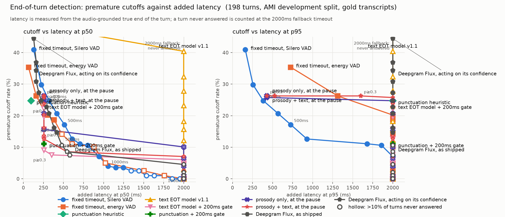

# The tradeoff curve — reading

Every number below is from `tradeoff.csv`, produced by `uv run python -m
eval.sweep` over the 198 frozen turns in `data/eval/`. Latency is measured from
the audio-grounded true end of the turn; a turn never answered is counted at
the 2000ms fallback. Cutoff rate is at the 150ms boundary tolerance.

**The text-only model v1 is on the chart, and it loses.** Read that section
first; the baseline reading below it is unchanged.

## text EOT model v1 — measured, does not beat the timer

| system | cutoff (tol) | hold | p50 | p95 |
|---|---|---|---|---|
| Silero timer, 800ms | 10.6% | 4.5% | 800 | 885 |
| punctuation heuristic | 24.7% | 6.6% | 96 | 2000 |
| **text EOT v1 @0.5** | **53.5%** | 10.1% | 160 | 2000 |
| text EOT v1 @0.9 | 12.1% | **64.1%** | 2000 | 2000 |

To approach the 800ms timer's cutoff rate the model must refuse to answer on
64% of turns. Its curve is the yellow wall at the fallback. Dominated at every
threshold.

**Why, with numbers** (full detail in the Phase 4 commit message):

- **Turn-level separability is 55.1%.** On 89 of 198 turns some prefix of the
  turn scores higher than the whole turn, so no threshold can be right. By
  stratum: short **89%**, ordinary 33%, disfluent 42%. On disfluent turns the
  median max-prefix score (0.77) is *higher* than the median full-turn score
  (0.57).
- **Half the false fires are on the first word** — `Okay`, `Oh`, `Um`. In
  training, `Okay` alone is a whole turn 61% of the time. Text cannot tell
  `Okay.` from `Okay so the thing is`; a timer can, because it waits. This is
  the Phase 3 label-collision ceiling, now at turn level.
- **Streaming compounds precision.** 0.36 per-example precision at 0.5, ~5
  prefixes per turn, one false fire is a cutoff. Class weighting (6.1× on
  positives) pushed the model *toward* firing — backwards for this metric.
- **The ranking is weak and the model overfits fast.** Val AP 0.505 on 10
  held-out speakers; best epoch is 1 in every run. AMI's scenario meetings all
  discuss one fictional product and the model memorises it.

**What worked:** short answers — 89% separable, median P(complete) 0.92 —
which is exactly the stratum where every timer is worst. The semantic signal
does the thing it was built for there and fails where the timer's patience is
the advantage. Latency is a non-issue: 0.41ms p50 per inference, 20× under
budget.

## What the chart says

**1. There is an empty region, and it is the whole point.**
Nothing on this chart achieves both under 10% premature cutoffs *and* under
500ms median latency. The best timer needs **900ms** to get under 10% cutoff
(p50 944ms). The punctuation heuristic answers at **96ms** but cuts off
**24.7%** of turns. Bottom-left is unoccupied. A semantic model earns its place
by putting a point there; if it cannot, the project reports that plainly.

**2. At equal cutoff rate, the semantic signal is 3.3× faster.**
The Silero timer at 300ms and the punctuation heuristic both cut off 24.7% of
turns. The timer does it at p50 **320ms**; punctuation at **96ms**. Same
damage, a third of the wait — because a signal that reads *what was said* does
not have to wait out silence to know the sentence ended. This is the mechanism
the project is betting on, demonstrated by a heuristic that looks at one
character.

**3. But the heuristic's tail is a wall.**
Punctuation's p95 is **2000ms** — the fallback. 6.6% of turns never end in
terminal punctuation, so on those the caller waits the full timeout. A median
of 96ms hides a p95 of two seconds. The charter's rule about never reporting a
single percentile exists for exactly this.

**4. The naive silence source is not viable.**
Energy thresholding looks competitive at p50 and collapses at p95: its p95 hits
the 2000ms wall from a 300ms timeout onward, because it holds the floor on
12.1% of turns at 500ms, 31.3% at 800ms, 46.5% at 1000ms — re-triggering on
room tone after the speaker stops. Baseline #2 (Silero) exists because
baseline #1 does not work.

**5. The industry default is measurably bad on this data.**
A 500ms Silero timer interrupts **17.2%** of turns. At 1000ms that falls to
4.0% — and 7.6% of turns now wait the full fallback, with p95 at the wall.
There is no timeout on this set that is both safe and fast.

## Where a timer beats the heuristic, and where it does not

| you need | timer | punctuation | winner |
|---|---|---|---|
| cutoffs under 20% | 500ms, p50 512ms | cannot (stuck at 24.7%) | timer |
| cutoffs under 10% | 900ms, p50 944ms | cannot | timer |
| median response under 150ms | 100ms, 40.9% cutoff | 96ms, 24.7% cutoff | punctuation |
| a bounded p95 | any timeout ≤ 500ms | never (p95 = fallback) | timer |

The heuristic wins only if ~25% cutoffs are acceptable. They almost never are.
So the practical conclusion is not "use punctuation" — it is that **the
latency headroom is real and large, and a model that keeps the semantic speed
while fixing the semantic cutoffs has ~600ms to gain over the best timer.**

## Caveats that travel with these numbers

- **Gold transcripts.** Punctuation here is placed by human annotators who
  heard the whole recording. A streaming recogniser punctuates causally from a
  hypothesis it keeps revising. The Phase 6 real-ASR condition measures how
  much that flatters baseline #3; until then, its numbers are a ceiling.
- **Meeting speech, 16kHz headset.** The deployment target is telephony.
  Phase 6 adds the 8kHz band-limited condition.
- **The boundary is Silero-refined, and Silero is baseline #2.** Mitigated
  (raw probability, not the smoothed flag) and quantified (boundary delta
  p10 −144ms, p90 +145ms), but the ground truth shares a model with one system
  under test.
- **19 speakers, 198 turns.** A cutoff-rate difference of one turn is 0.5%.
  Differences under ~2% between systems are inside the noise.
